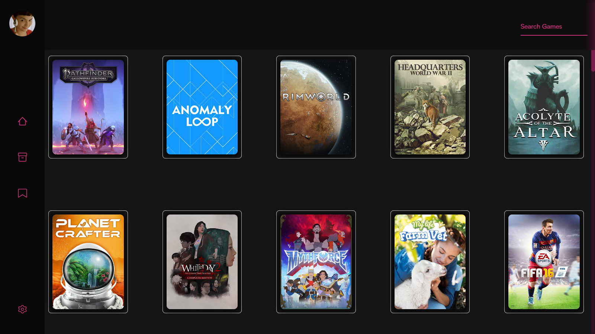
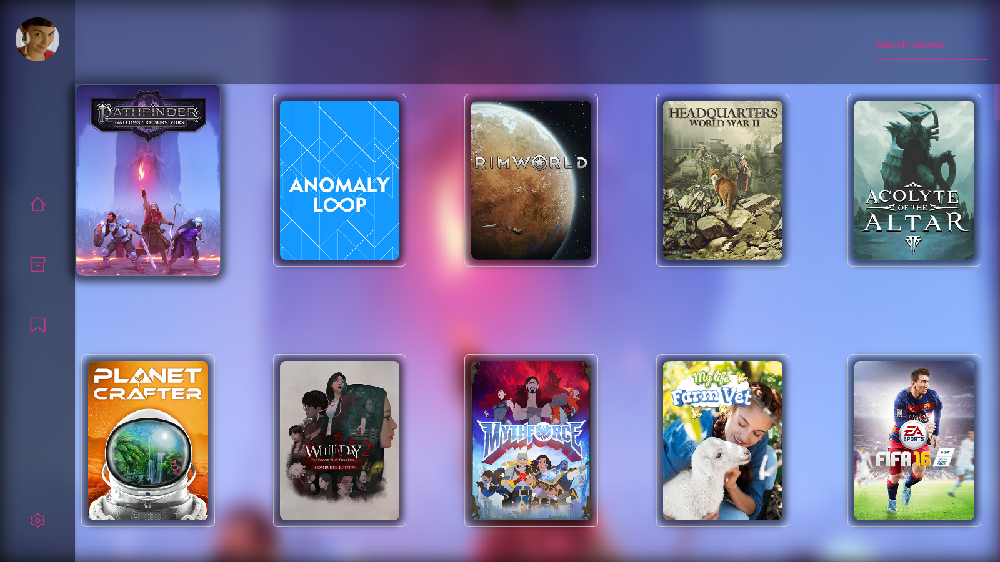
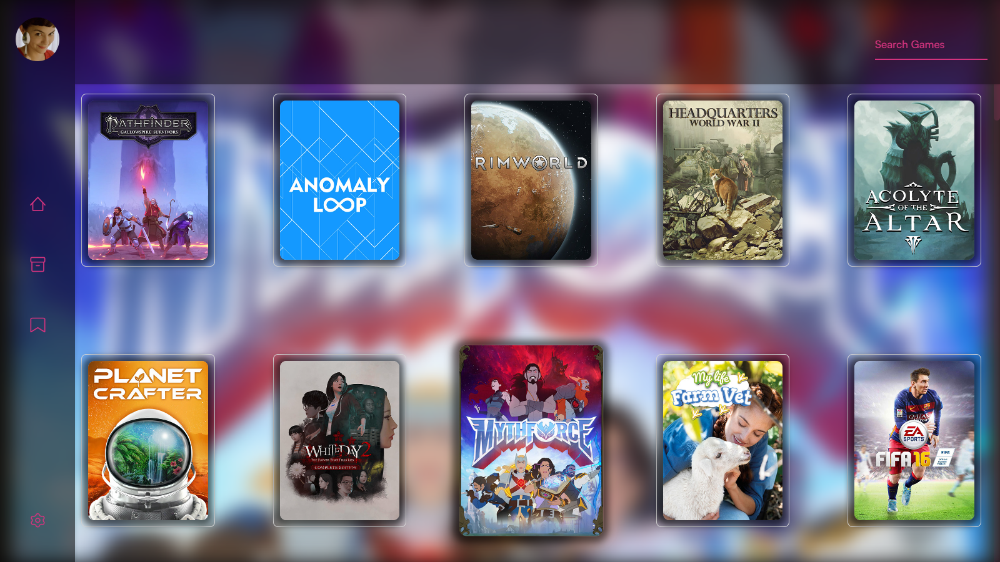
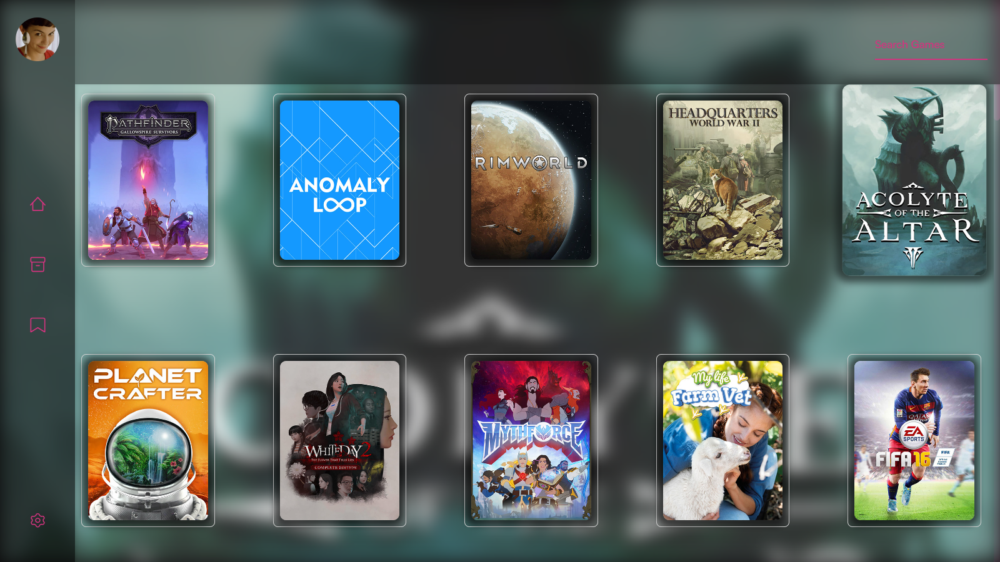
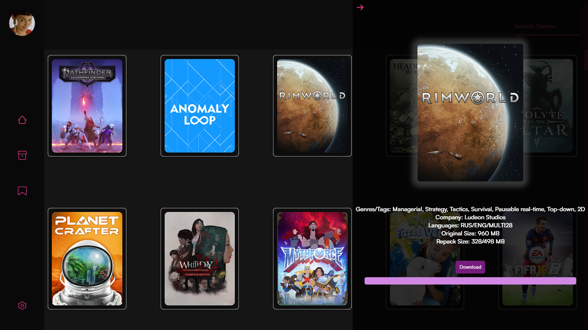

# FitGirl Launcher App

FitGirl Launcher is an Electron-based application built using vanilla JavaScript. It provides a platform to download and manage games from FitGirl Repacks.

## Installation

To install and run the application locally, follow these steps:

    1. Clone this repository to your local machine.
    2. Navigate to the project directory.
    3. Run `npm install` to install the necessary dependencies.
    4. Run `npm start` to start the application.

### Example
To install you have to get Node JS on your computer.

Clone the project  

~~~bash  
  git clone https://github.com/CarrotRub/Fitgirl-Repack-Launcher
~~~

Go to the project directory  

~~~bash  
  cd Fitgirl-Repack-Launcher
~~~

Install dependencies  

~~~bash  
npm install
~~~

Start the app

~~~bash  
npm start
~~~  

## Usage

Once the application is running, you can:

    - Download games from FitGirl Repacks.
    - Manage settings such as theme, download location, and seeding options (Working on it...).
    - View downloaded games in the library and mark them as favorites (Working on it...).
    - Access the favorites page to see your favorite games (Working on it...).

## Images

Here are some screenshots of the FitGirl Launcher App:

## Todo List

### Settings Page

- [ ]  Create a display to show information about the app and its creator(s).
- [ ]  Implement settings display, including theme and other options as well as importing external CSS code.
- [ ]  Display download information such as download location and seeding status.
- [ ]  Complete settings page with seeding and path options.

### Library Page

- [x]  Make downloaded games appear in the library.
- [ ]  Add checkmark to downloaded games in the library.

### Favorites Page

- [ ]  Store favorite games in a JSON file and localStorage.
- [ ]  Implement display of favorite games on a separate favorites page.
- [ ]  Implement the ability to mark a game as a favorite via right-click option.

## How It Works

FitGirl Launcher utilizes web scraping with Puppeteer to extract game information and download links from the FitGirl Repacks website. Since FitGirl does not provide an API, Puppeteer is used to automate the process of fetching data from the website.

## Contributing

Pull requests are welcome. For major changes, please open an issue first to discuss what you would like to change.

## License

[GPL-3.0](https://choosealicense.com/licenses/gpl-3.0/)
